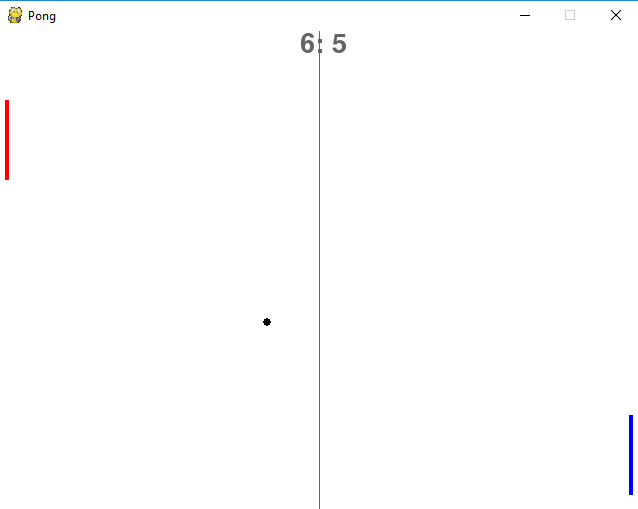

# Pong Using RL 

## Overview
Simple implementation for a single player pong game.
  
The aim is to implement Reinforcement Learning concepts to make the AI win at this game. Refer article [Deep Reinforcement Learning: Pong from Pixels](http://karpathy.github.io/2016/05/31/rl/) by <b>Andrej Karpathy</b>.

## Requirements
- Pygame (Install using pip: ``pip install pygame``)

## Usage
Run ``python pong.py``

### Screenshot
